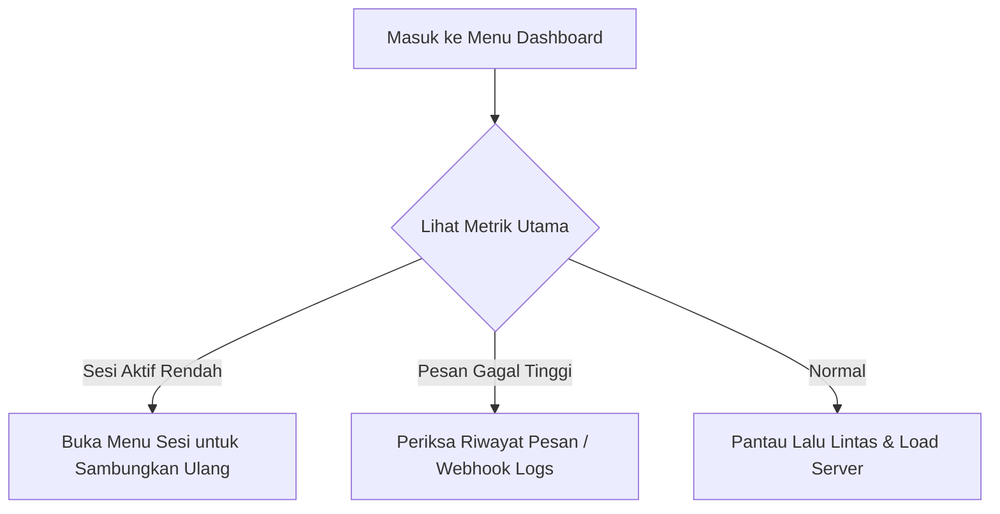
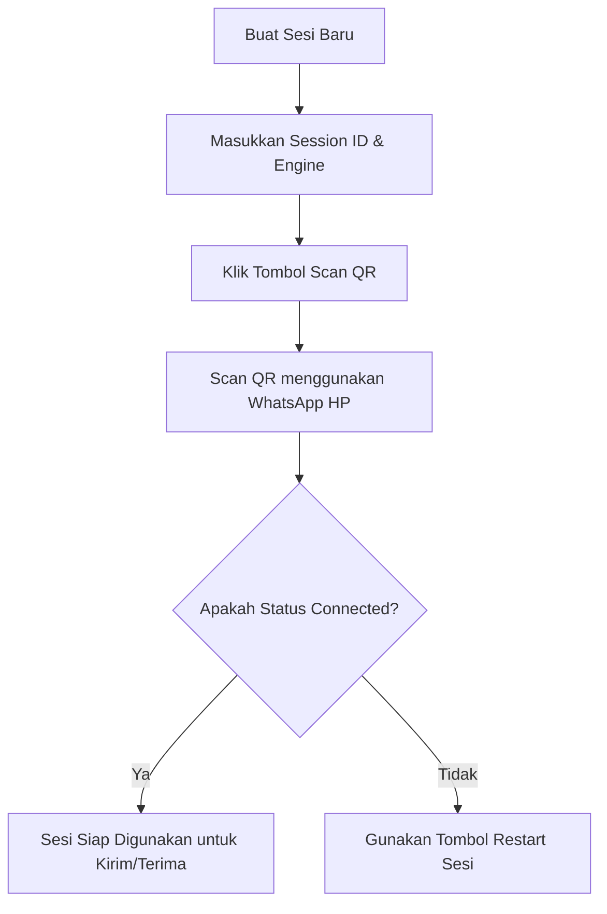
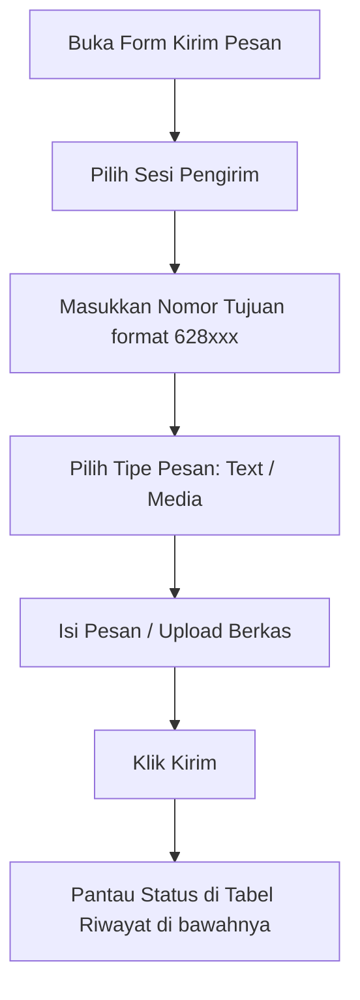
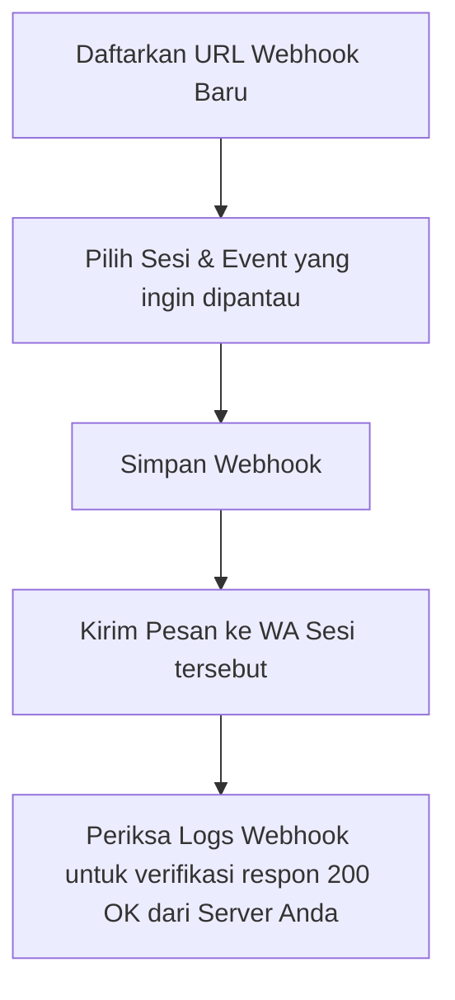

# Panduan Bantuan Kontekstual Menu - Velora WA

Dokumen ini berisi dokumentasi bantuan super detail untuk masing-masing menu di dashboard Velora WA. Setiap menu memiliki tombol bantuan (**Floating Action Button / FAB**) sendiri, yang menampilkan panduan spesifik untuk menu tersebut ketika diklik.

---

## 1. 📊 Menu: Dashboard

### A. Deskripsi Detail
Menu **Dashboard** adalah pusat informasi utama (main overview) yang menyajikan rangkuman aktivitas sistem secara real-time. Menu ini dirancang untuk memberikan visibilitas cepat terhadap kesehatan aplikasi, aktivitas pengiriman pesan, dan statistik performa tanpa harus menavigasi ke menu lain.

### B. Fitur & Metrik yang Ditampilkan
1.  **Metrik Utama (Key Metrics Card)**:
    *   **Total Pesan Terkirim:** Akumulasi pesan yang sukses dikirim dari semua sesi.
    *   **Pesan Tertunda (Pending):** Jumlah pesan dalam antrean yang menunggu giliran kirim.
    *   **Pesan Gagal:** Total pesan yang gagal dikirim karena nomor tidak valid atau masalah koneksi.
    *   **Sesi Aktif:** Jumlah sesi WhatsApp yang saat ini terhubung (Connected) dibandingkan total sesi terdaftar.
2.  **Grafik Performa (Performance Charts)**:
    *   Grafik tren lalu lintas pesan harian/mingguan untuk melihat beban penggunaan API.
3.  **Audit Logs Ringkas (Recent Activity)**:
    *   Daftar 5 hingga 10 aktivitas API atau perubahan sistem terbaru untuk audit cepat.

### C. Alur Penggunaan (Flow Detail)

1.  **Langkah 1:** Buka Dashboard setelah login.
2.  **Langkah 2:** Perhatikan kartu status **Sesi Aktif**. Jika jumlah sesi aktif lebih rendah dari yang diharapkan, segera klik pintasan untuk menuju ke menu *Sesi*.
3.  **Langkah 3:** Pantau rasio **Pesan Gagal**. Jika meningkat tajam, ini indikasi bahwa nomor Anda kemungkinan terblokir (*banned*) atau penerima tidak valid.
4.  **Langkah 4:** Gunakan grafik lalu lintas untuk mengukur apakah terjadi *spike* (lonjakan) request dari sistem eksternal Anda.

### D. Tips & Catatan Penting
> [!TIP]
> Data pada Dashboard diperbarui secara real-time menggunakan WebSocket. Jika grafik atau metrik tidak bergerak dalam beberapa menit, periksa apakah koneksi internet Anda stabil atau lakukan refresh halaman.

---

## 2. 🔌 Menu: Sesi (Sessions)

### A. Deskripsi Detail
Menu **Sesi (Sessions)** adalah menu paling kritikal di Velora WA. Di sinilah Anda mengelola daur hidup (*lifecycle*) koneksi akun WhatsApp Anda dengan mesin browser Chromium (whatsapp-web.js) atau pustaka alternatif (Baileys).

### B. Fitur yang Tersedia
1.  **Tambah Sesi (Create Session):** Mendaftarkan instans WhatsApp baru dengan ID unik.
2.  **Scan QR Code:** Menampilkan kode QR dinamis yang dihasilkan langsung dari Chromium untuk proses login WhatsApp Web.
3.  **Detail Sesi:** Memantau informasi baterai ponsel, status koneksi (Connected, Disconnected, Authenticating), dan nama perangkat.
4.  **Restart Sesi:** Mematikan browser Chromium yang macet dan menyalakan kembali instans sesi tersebut.
5.  **Hapus Sesi (Delete):** Menghapus data sesi secara permanen termasuk kredensial otentikasi lokal.

### C. Alur Penggunaan (Flow Detail)

#### Alur Menghubungkan Akun WhatsApp Baru:
1.  **Klik tombol "Tambah Sesi"** di sudut kanan atas.
2.  **Isi Form Tambah Sesi:**
    *   **Session ID:** Berikan nama unik (misal: `sesi-marketing-01`). Gunakan karakter alfanumerik tanpa spasi.
    *   **Engine Type:** Pilih `whatsapp-web.js` (direkomendasikan untuk stabilitas fitur) atau `baileys` (ringan tanpa Chromium).
3.  **Klik tombol "Scan QR"** pada baris sesi yang baru dibuat. Panel popup akan muncul dan melakukan *loading* (backend sedang menyalakan Chromium headless di server).
4.  **Tautkan Perangkat:** Buka aplikasi WhatsApp di HP Anda $\rightarrow$ *Tautan Perangkat* $\rightarrow$ *Tautkan Perangkat*, lalu arahkan kamera HP ke layar monitor untuk memindai QR Code.
5.  **Tunggu Sinkronisasi:** Status sesi di dashboard akan berubah otomatis: `Initializing` $\rightarrow$ `Authenticating` $\rightarrow$ `Connected`.
6.  **Selesai:** Setelah status berubah menjadi `Connected`, sesi Anda sudah aktif dan siap mengirim/menerima pesan.

### D. Tips & Catatan Penting
> [!IMPORTANT]
> Setiap sesi dengan engine `whatsapp-web.js` menjalankan instans browser Chromium tersendiri di server. Setiap instans Chromium membutuhkan sekitar **300MB - 500MB RAM**. Batasi jumlah sesi aktif agar memori server Anda tidak habis.

---

## 3. 👥 Menu: Kontak (Contacts)

### A. Deskripsi Detail
Menu **Kontak (Contacts)** digunakan untuk melihat dan mengelola semua kontak WhatsApp yang tersinkronisasi dari akun WhatsApp yang terhubung. Ini membantu Anda memverifikasi keberadaan nomor tujuan sebelum mengirim pesan massal.

### B. Fitur yang Tersedia
1.  **Sinkronisasi Kontak:** Menarik data kontak terbaru dari aplikasi WhatsApp di HP ke database Velora.
2.  **Pencarian & Filter:** Mencari kontak berdasarkan nama, nomor HP, atau filter berdasarkan status kepemilikan WhatsApp.
3.  **Detail Kontak:** Melihat info profil, JID (`@c.us`), dan foto profil terbaru.

### C. Alur Penggunaan (Flow Detail)
1.  **Pilih Sesi:** Pilih sesi aktif yang ingin dilihat kontaknya dari dropdown sesi di bagian atas.
2.  **Sinkronisasi:** Jika kontak tidak muncul atau baru saja menambah kontak di HP, klik **Sinkronkan Kontak**. Backend akan meminta data dari HP (membutuhkan waktu 10-30 detik tergantung jumlah kontak).
3.  **Pencarian:** Gunakan kotak pencarian untuk mencari nama kontak (misal: "Budi").
4.  **Kirim Pesan Langsung:** Klik ikon surat di samping nama kontak untuk langsung melompat ke form kirim pesan dengan nomor tujuan yang sudah terisi otomatis.

---

## 4. 👥 Menu: Grup (Groups)

### A. Deskripsi Detail
Menu **Grup (Groups)** menampilkan daftar seluruh grup WhatsApp di mana akun Anda tergabung di dalamnya. Kunci utama penggunaan menu ini adalah untuk mendapatkan **JID Grup** (misal: `120363028392019@g.us`), yang digunakan sebagai parameter tujuan saat mengirim pesan API ke grup.

### B. Fitur yang Tersedia
1.  **Daftar Grup:** Menampilkan seluruh nama grup, foto grup, dan ID JID grup.
2.  **Detail Anggota:** Melihat daftar anggota grup beserta peran mereka (Admin atau Anggota Biasa).
3.  **Ekspor Anggota:** Mengekspor daftar nomor anggota grup untuk keperluan leads atau database eksternal.

### C. Alur Penggunaan (Flow Detail)
1.  **Pilih Sesi Aktif** dari dropdown di bagian atas.
2.  **Klik "Muat Grup"** untuk mengambil struktur grup terbaru dari HP.
3.  **Salin JID Grup:** Temukan nama grup yang ingin Anda kirimi pesan, lalu klik tombol **Salin JID** di samping kanan nama grup.
4.  **Kirim Pesan ke Grup:** Masukkan JID yang disalin tadi ke kolom nomor tujuan pada API payload (`/api/messages/send`) untuk mengirim pesan otomatis ke dalam grup tersebut.

---

## 5. ✉️ Menu: Pesan (Messages)

### A. Deskripsi Detail
Menu **Pesan (Messages)** menyediakan antarmuka pengiriman pesan manual (untuk uji coba cepat) serta menampilkan log/riwayat lengkap lalu lintas pesan masuk dan keluar (incoming & outgoing logs).

### B. Fitur yang Tersedia
1.  **Kirim Pesan Instan (Form Uji Coba):**
    *   Mendukung pengiriman pesan teks biasa.
    *   Mendukung pengiriman pesan media (Gambar, PDF, Audio, Video) dengan upload langsung atau via URL.
2.  **Riwayat Pesan (Message Logs):**
    *   Tabel log detail berisi: Waktu Kirim, Sesi Pengirim, Nomor Penerima, Isi Pesan, Tipe Pesan (chat, image, document), dan Status.
3.  **Pencarian Riwayat:** Filter riwayat pesan berdasarkan status (`Pending`, `Sent`, `Delivered`, `Read`, `Failed`) atau kata kunci teks.

### C. Alur Penggunaan (Flow Detail)

#### Alur Mengirim Uji Coba Pesan Gambar:
1.  Buka tab **Kirim Pesan** pada menu Pesan.
2.  Pilih **Sesi Aktif** yang akan mengirimkan pesan.
3.  Masukkan nomor tujuan di kolom **Nomor Penerima** (contoh: `628123456789`). *Selalu gunakan format kode negara tanpa tanda '+' atau angka '0' di depan.*
4.  Ubah tipe pesan ke **Media / File**.
5.  Seret berkas gambar Anda ke kotak upload, atau tempelkan URL gambar yang valid.
6.  (Opsional) Tulis teks takarir (*caption*) di bawah gambar.
7.  Klik **Kirim**. Status pesan akan muncul instan di tabel riwayat di bawahnya sebagai `Sent` $\rightarrow$ `Delivered` (centang dua) $\rightarrow$ `Read` (jika penerima membaca pesan).

### D. Tips & Catatan Penting
> [!WARNING]
> Untuk menghindari pemblokiran nomor (*banned*) oleh pihak WhatsApp, hindari mengirimkan pesan blast dalam jumlah ribuan sekaligus tanpa jeda waktu. Gunakan fitur *jeda acak (random delay)* minimal **10 - 20 detik** antar-pesan pada aplikasi external Anda yang memanggil API Velora.

---

## 6. 🪝 Menu: Webhook

### A. Deskripsi Detail
Menu **Webhook** adalah jembatan integrasi asinkron antara Velora WA dengan backend aplikasi Anda sendiri (atau layanan no-code seperti n8n, Make, dan Zapier). Setiap kali ada event baru di WhatsApp (misal: pesan masuk), Velora akan melakukan HTTP POST ke URL yang Anda daftarkan di sini.

### B. Fitur yang Tersedia
1.  **Daftar Webhook:** Mendaftarkan satu atau lebih URL tujuan webhook.
2.  **Filter Event:** Memilih event apa saja yang ingin dikirimkan ke URL tertentu (misal: hanya mengirim event `message.received` ke URL A, dan event `session.status` ke URL B).
3.  **Logs Delivery:** Memantau riwayat pengiriman request webhook beserta response code dari server Anda (misal: `200 OK`, `500 Internal Server Error`).

### C. Alur Penggunaan (Flow Detail)

#### Alur Integrasi Webhook:
1.  Klik **Tambah Webhook**.
2.  Isi **URL Target** dengan endpoint server Anda yang bertugas memproses data masuk (contoh: `https://api.bisnisanda.com/webhook/v1/whatsapp`).
3.  Pilih event yang ingin ditangkap:
    *   `message.received` (Pesan masuk baru - paling sering digunakan).
    *   `message.ack` (Perubahan status centang pesan).
    *   `session.status` (Notifikasi jika sesi tiba-tiba terputus).
4.  Klik **Simpan**.
5.  Lakukan pengujian dengan mengirimkan pesan WhatsApp dari nomor luar ke akun WhatsApp yang terhubung di Velora.
6.  Periksa bagian **Webhook Logs** di bawah. Anda harus melihat entri baru dengan kode status HTTP `200` atau `201`. Jika kodenya `500` atau `404`, periksa kembali kode program di server Anda.

### D. Tips & Catatan Penting
> [!CAUTION]
> Server Anda wajib merespon request webhook dari Velora secepat mungkin (dalam kurun waktu < 5 detik) dengan status HTTP `200 OK`. Jika lambat, backend Velora akan menganggap request timeout dan akan melakukan percobaan ulang (*retry* hingga 3 kali), yang dapat menyebabkan data masuk ganda di sistem Anda.

---

## 7. ⚙️ Menu: Pengaturan (Settings)

### A. Deskripsi Detail
Menu **Pengaturan (Settings)** digunakan untuk mengonfigurasi parameter sistem global Velora, otentikasi keamanan, limitasi kecepatan (rate limit), serta mengakses dokumentasi interaktif Swagger API.

### B. Fitur yang Tersedia
1.  **Keamanan Keamanan (Security Settings):** Mengubah `API_MASTER_KEY` yang digunakan sebagai Bearer Token otentikasi di semua request API.
2.  **Rate Limits:** Membatasi jumlah maksimum request API per menit untuk menghindari beban berlebih pada server.
3.  **Swagger API Docs:** Tautan langsung menuju dokumentasi API interaktif (`/docs`) untuk kebutuhan developer melakukan uji coba endpoint langsung dari browser.

### C. Alur Penggunaan (Flow Detail)
1.  **Mendapatkan API Key:** Masuk ke tab Keamanan, lalu salin token yang tertera pada kolom **API Master Key**.
2.  **Menguji API via Swagger:** Klik tombol **Buka Dokumentasi Swagger**. Halaman baru akan terbuka. Klik tombol *Authorize* di kanan atas, tempelkan API Master Key yang disalin tadi, lalu Anda bisa mencoba seluruh endpoint API Velora langsung dari sana.
3.  **Rotasi Token Berkala:** Jika Token terindikasi bocor, ketikkan token acak baru di kolom API Master Key lalu klik **Simpan**. Segera perbarui token pada aplikasi klien atau integrasi eksternal Anda.

---

## 8. 📋 Menu: Template Pesan (Templates)

### A. Deskripsi Detail
Menu **Template Pesan (Templates)** dirancang untuk mempermudah operasional pengiriman pesan berulang dengan menyimpan format teks/takarir siap pakai. Fitur ini sangat berguna untuk pesan sapaan, balasan FAQ, atau notifikasi transaksional yang memiliki pola teks serupa.

### B. Fitur yang Tersedia
1.  **Buat Template Baru:** Menyimpan judul dan isi pesan template.
2.  **Variabel Kustom (Placeholder):** Mendukung penggunaan variabel dinamis seperti `{{name}}` yang akan digantikan otomatis oleh nama penerima saat dikirim.
3.  **Filter & Pencarian:** Menemukan template secara cepat berdasarkan nama atau ID template.

### C. Alur Penggunaan (Flow Detail)
1.  **Buat Baru:** Klik tombol **Tambah Template** di sudut kanan atas.
2.  **Isi Formulir:**
    *   **Nama Template:** Masukkan judul pengenal (misal: `sapaan-pelanggan`).
    *   **Konten Pesan:** Ketikkan isi pesan. Gunakan format `{{name}}` di bagian yang ingin diganti nama dinamisnya (contoh: *"Halo {{name}}, terima kasih telah menghubungi kami..."*).
3.  **Simpan:** Klik **Simpan**.
4.  **Gunakan via API / Tester:** Panggil ID template tersebut lewat endpoint API pengiriman pesan template, atau gunakan langsung saat memilih template di menu penguji pesan.

---
